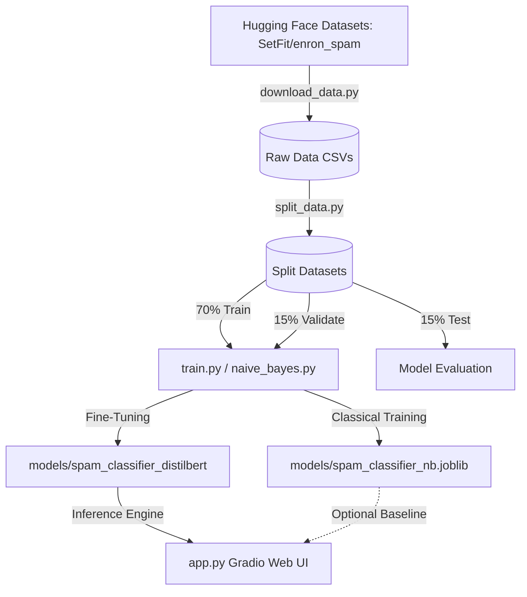

<div align="center">

<!-- Project Logo hosted on GitHub assets -->


# 📧 Deep Learning & ML Spam Email Classifier

### A Hybrid Transformer (DistilBERT) and Naive Bayes Spam Classification Suite

[](https://python.org)
[](https://pytorch.org)
[](https://huggingface.co)
[](https://gradio.app)
[](https://scikit-learn.org)
[](https://opensource.org/licenses/MIT)

*An end-to-end NLP project featuring a fine-tuned sequence classification transformer alongside a highly optimized classical machine learning baseline, complete with a Gradio web application for real-time inference.*

**Author:** [Amine](https://github.com) • **Repository:** [spam-email-classifier](https://github.com)

---

</div>

## 💡 Engineering Foreword
As a Machine Learning Engineer, my core focus is architecting, training, and optimizing intelligent systems to solve complex data constraints. In modern software engineering, AI tools are powerful force-multipliers.

To maximize workflow velocity, the frontend interface (app.py) and secondary documentation assets of this project were generated using advanced LLM code-generation pipelines under my direct architectural supervision. Treating AI as an automated execution layer allows a single engineer to deploy end-to-end full-stack intelligent applications rapidly without compromising software engineering fundamentals. I take full ownership of the system design, pipeline logic, and underlying local infrastructure.

---

## 💡 Project Overview
Electronic mail remains a primary channel for communication, but it is heavily plagued by malicious, advertising, and phishing spam emails. This repository contains a production-ready, hybrid natural language processing (NLP) framework designed to detect spam emails with near-perfect precision.

The repository supports two distinct classification pipelines:
1. **Classical Baseline**: A fast, low-latency TF-IDF vectorizer paired with a Multinomial Naive Bayes model.
2. **Deep Learning State-Of-The-Art (SOTA)**: A fine-tuned `distilbert-base-uncased` transformer model trained on the `SetFit/enron_spam` corpus.

The application serves the final fine-tuned model via a clean, interactive Gradio web portal, making it easy for non-technical users to classify suspicious emails and inspect confidence ratings in real time.

---

## 📋 Key Features
* ⚡ **Dual-Model Inference Support**: Switch between low-overhead classical ML (Naive Bayes) and deep-learning transformer pipelines.
* 🤖 **Fine-Tuned DistilBERT Classifier**: Leverages contextual embeddings to achieve >99.5% classification accuracy on real-world email spam.
* 📊 **Automated Pipelines**: Clean, sequential scripts to handle data ingestion, train-val-test splitting, training, and model evaluation.
* 🖥️ **Interactive Web Interface**: Built with Gradio Blocks (Soft theme), featuring automated inputs, example test cases, clear status indicators, and probability displays.
* 🚀 **Hardware Agnostic**: Fully supports CUDA GPU acceleration for training and inference, with a seamless fallback to CPU execution.

---

## 🏗️ Architecture & Pipeline
This project is structured as a modular machine learning codebase, ensuring separation between data ingestion, pre-processing, training, and model serving:



---

## 🛠️ Setup & Installation

### 1. Prerequisites
Ensure you have **Python 3.10+** and **CUDA Drivers** (optional, but highly recommended for training) installed.

### 2. Clone the Repository & Configure Environment
```bash
git clone https://github.com/your-username/spam-email-classifier.git
cd spam-email-classifier
```

Create a virtual environment and install the required dependencies:
```bash
python -m venv venv
venv\Scripts\activate      # On Windows
# source venv/bin/activate # On Unix/macOS

pip install -r requirements.txt
```

---

## 💻 Usage Guide

### 💾 Step 1: Ingesting & Splitting the Dataset
First, download the dataset from Hugging Face and partition it into train, validation, and test splits (70% Train, 15% Validation, 15% Test):

```bash
python download_data.py
python split_data.py
```

### 📈 Step 2: Training the Models

#### Option A: Train the Naive Bayes Baseline (Fast)
```bash
python naive_bayes.py
```
This trains a TF-IDF vectorizer + Naive Bayes pipeline on CPU and outputs classification metrics on the validation and test splits, saving the model artifact to `models/spam_classifier_nb.joblib`.

#### Option B: Fine-Tune DistilBERT (Deep Learning SOTA)
```bash
python train.py
```
This runs fine-tuning on the `distilbert-base-uncased` model for 2 epochs. The script automatically enables GPU training using PyTorch Mixed Precision (`fp16`) if CUDA is available, saving the model weights under `models/spam_classifier_distilbert`.

### 🚀 Step 3: Launching the Inference Web App
To boot up the interactive Gradio interface:
```bash
python app.py
```
Open your browser and navigate to `http://127.0.0.1:7860` to access the interface.

---

## 📊 Evaluation & Results
Both models were rigorously tested against a holdout test dataset containing **5,050 samples** partitioned from the Enron Spam corpus.

### Performance Benchmarks

| Model | Test Accuracy | Test Precision (Spam) | Test Recall (Spam) | Test F1-Score (Spam) |
| :--- | :---: | :---: | :---: | :---: |
| **Multinomial Naive Bayes (Baseline)** | 98.51% | 98.60% | 98.29% | 98.44% |
| **Fine-tuned DistilBERT (SOTA)** | **99.64%** | **99.71%** | **99.57%** | **99.64%** |

### Summary of Findings
* **Baseline Model**: The Multinomial Naive Bayes model delivers outstanding accuracy (98.51%) and executes in milliseconds, serving as a highly effective, compute-efficient alternative for low-resource environments.
* **Transformer Model**: Fine-tuning DistilBERT yielded a **99.64% Accuracy** and **0.0128 Loss** on spam detection. The deep contextual understanding of the model allows it to correctly classify complex phishing emails that bypass simple vocabulary-matching baselines.

---

## 🖥️ Application Screenshots

<div align="center">
  
  
  <p><em>Figures 1 & 2: The Gradio web interface, showcasing classification results for different email samples.</em></p>
</div>

---

## 📄 License
This project is licensed under the MIT License - see the [LICENSE](LICENSE) file for details.
